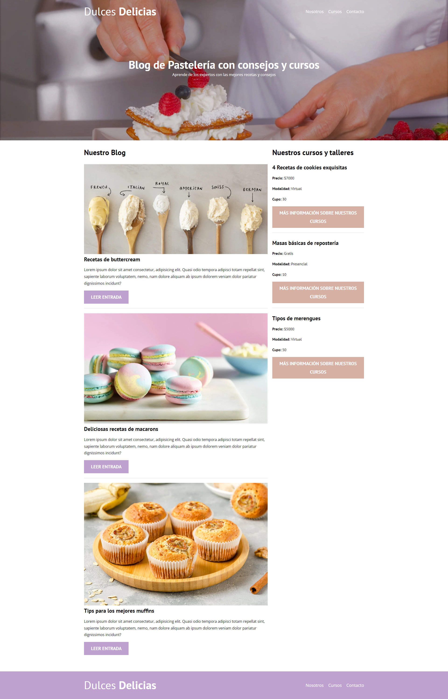
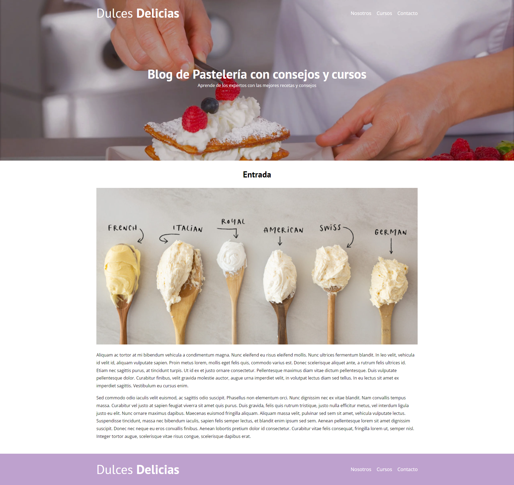
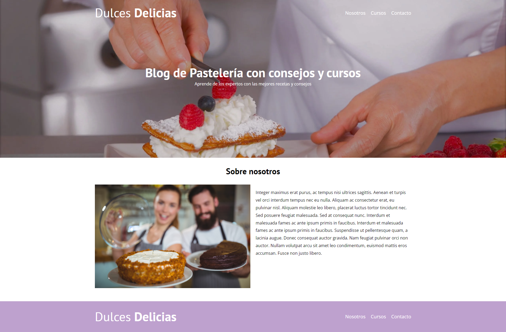
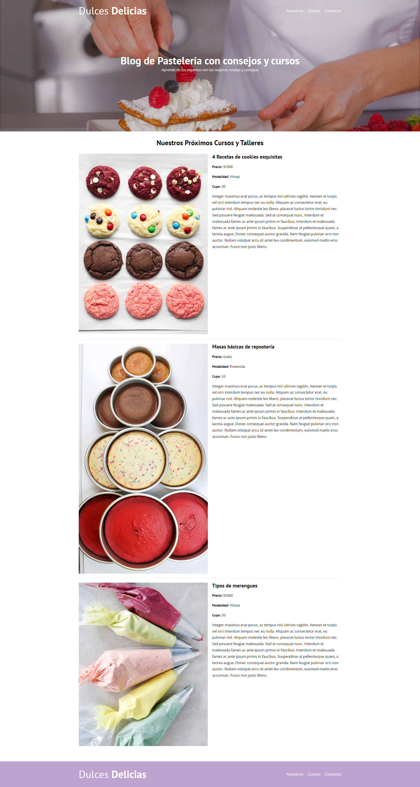
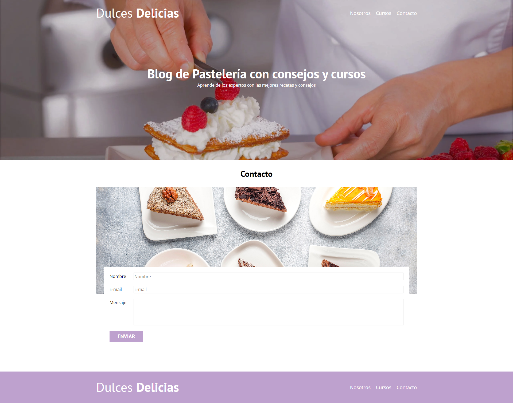
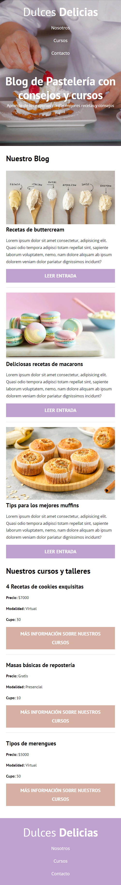
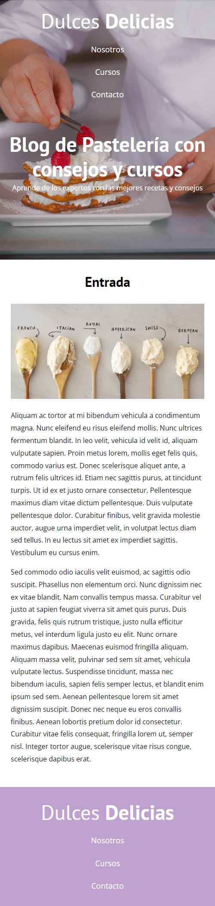
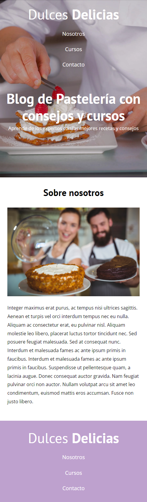
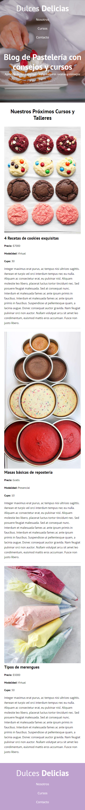
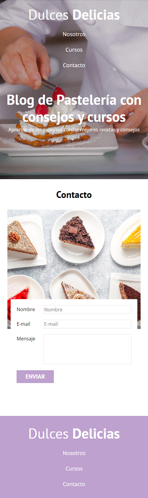

# 🍰 Dulces Delicias 🍰

Este es un proyecto de blog de pastelería que proporciona recetas, consejos y cursos relacionados con el arte de la pastelería. El sitio web está construido utilizando HTML y CSS, e implementa las metodologías de RWD (Responsive Web Design), BEM, Grid, Flexbox y Modernizr para crear una interfaz flexible y adaptable en diferentes dispositivos y tamaños de pantalla.

<a href="https://matias-barraza.github.io/blog-reposteria/" target="_blank">¡Visítala aquí!</a>

## 📸 Capturas de pantalla 📸

A continuación, se muestran capturas de pantalla de las distintas partes de la página y formatos para diferentes dispositivos.

**💻 Versión Desktop 💻**

**1. Index:**

 

**2. Entrada:**

 

**3. Nosotros:**

 

**4. Cursos:**

 

**5. Contacto:**

 

**🤳 Versión Mobile 🤳**

**1. Index:**

 

**2. Entrada:**

 

**3. Nosotros:**

 

**4. Cursos:**

 

**5. Contacto:**

 

Si te ha gustado esta breve presentación, no dudes más y visita la página en el siguiente enlace:

<a href="https://matias-barraza.github.io/blog-reposteria/" target="_blank">¡Visítala aquí!</a>
